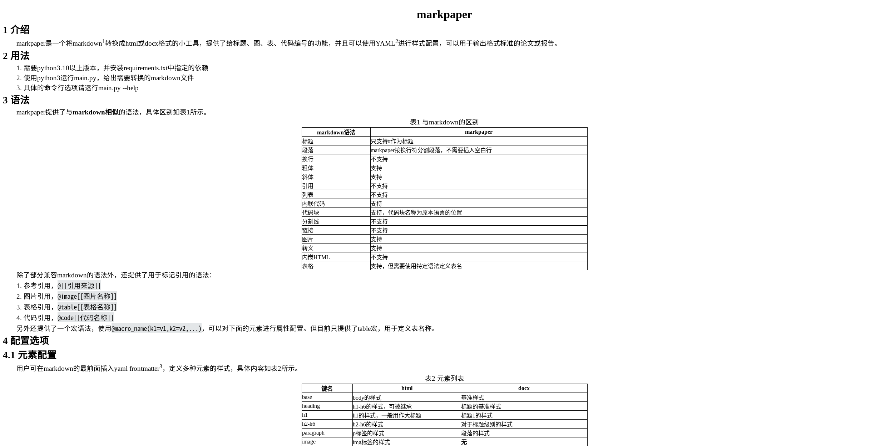

---
table:
  width: 600
image:
  width: 600
code:
  block_alignment: center
  width: 600
---
# markpaper

## 介绍

markpaper是一个将markdown@[[https://en.wikipedia.org/wiki/Markdown ]]转换成html或docx格式的小工具，提供了给标题、图、表、代码编号的功能，并且可以使用YAML@[[https://yaml.org/ ]]进行样式配置，可以用于输出格式标准的论文或报告。

## 用法

1. 需要python3.10以上版本，并安装requirements.txt中指定的依赖
2. 使用python3运行main.py，给出需要转换的markdown文件
3. 具体的命令行选项请运行main.py --help

## 语法

markpaper提供了与**markdown相似**的语法，具体区别如@table[[与markdown的区别]]所示。

@table(name="与markdown的区别")

| markdown语法 | markpaper |
| -- | -- |
| 标题 | 只支持#作为标题 |
| 段落 | markpaper按换行符分割段落，不需要插入空白行 |
| 换行 | 不支持 |
| 粗体 | 支持 |
| 斜体 | 支持 |
| 引用 | 不支持 |
| 列表 | 不支持 |
| 内联代码 | 支持 |
| 代码块 | 支持，代码块名称为原本语言的位置 |
| 分割线 | 不支持 |
| 链接 | 不支持 |
| 图片 | 支持 |
| 转义 | 支持 |
| 内嵌HTML | 不支持 |
| 表格 | 支持，但需要使用特定语法定义表名 |

除了部分兼容markdown的语法外，还提供了用于标记引用的语法：

1. 参考引用，`@[[引用来源]]`
2. 图片引用，`@image[[图片名称]]`
3. 表格引用，`@table[[表格名称]]`
4. 代码引用，`@code[[代码名称]]`

另外还提供了一个宏语法，使用`@macro_name(k1=v1,k2=v2,...)`，可以对下面的元素进行属性配置。但目前只提供了table宏，用于定义表名称。

## 配置选项

### 元素配置

用户可在markdown的最前面插入yaml frontmatter@[[https://docs.zettlr.com/en/core/yaml-frontmatter/ ]]，定义多种元素的样式，具体内容如@table[[元素列表]]所示。

@table(name="元素列表")

| 键名            | html          | docx           |
|:--------------|---------------|----------------|
| base          | body的样式       | 基准样式           |
| heading       | h1-h6的样式，可被继承 | 标题的基准样式        |
| h1            | h1的样式，一般用作大标题 | 标题1的样式         |
| h2-h6         | h2-h6的样式      | 对于标题级别的样式      |
| paragraph     | p标签的样式        | 段落的样式          |
| image         | img标签的样式      | **无**          |
| imageRef      | 图片引用span的样式   | 图片引用的样式，只能配置字体 |
| imageLabel    | 图片名称的样式       | 图片名称的样式        |
| table         | table标签的样式    | 表格样式           |
| tableRef      | 表格引用span的样式   | 表格引用的样式，只能配置字体 |
| tableLabel    | 表格名称的样式       | 表格名称的样式        |
| tableCell     | td标签的样式       | 除了表头之外的单元格的样式  |
| tableHeadCell | th标签的样式       | 表头单元格的样式       |
| code          | pre标签的样式      | **无**          |
| codeLabel     | 代码名称的样式       | 代码名称的样式        |
| all           | 匹配所有元素的样式     | 无              |
| codeSpan      | code标签的样式     | 内联代码的样式        |

### 属性配置

可配置的属性列表如@table[[属性列表]]所示，所有的样式属性html都支持，docx部分支持。

@table(name="属性列表")

| 键名                | 类型                                 | 用途                | docx |
|-------------------| ------------------------------------ |-------------------| ---- |
| color             | str                                  | 字体颜色              | ✓    |
| font_size*        | int                                  | 字体大小              | ✓    |
| en_font           | str                                  | 英文字体              | ✓    |
| cn_font           | str                                  | 中文字体              | ✓    |
| bold              | bool                                 | 粗体                | ✓    |
| italic            | bool                                 | 斜体                | ✓    |
| width*            | int                                  | 宽度                | ✘    |
| height*           | int                                  | 高度                | ✘    |
| first_line_indent | int                                  | 首行缩进（字符）          | ✓    |
| line_spacing*     | int                                  | 行间距               | ✓    |
| line_spacing_type | "1", "1.5", "2"                      | 行间距类型（单倍、1.5倍，双倍） | ✓    |
| alignment         | "right", "left", "center", "justify" | 对齐                | ✓    |
| block_alignment   | "right", "left", "center", "justify" | 块元素对齐             | ✓    |
| border_width*     | int                                  | 边框宽度              | ✘    |
| border_style      | "solid"                              | 边框类型              | ✘    |
| border_color      | str                                  | 边框颜色              | ✘    |
| border_collapse   | "collapse", "separate"               | 边框折叠              | ✘    |
| word_wrap         | bool                                 | 允许英文单词内换行         | ✓    |
| display           | "inline", "block", "none"            | 显示                | ✘    |
| margin            | str                                  | 外边距               | ✘    |
| padding           | str                                  | 内边距               | ✘    |
| background        | str                                  | 文字背景色             | ✘    |

*: 采用的单位为pt（磅）

另外对于标签类和标题类的元素，还提供了一个format属性，用于配置输出格式。可以选用的占位符有：

1. {gi} 该标签在整个文章中的编号
2. {s1} - {s6} 对于级别的标题编号
3. {name} 元素的name属性
4. {text} 元素的text属性

### 默认配置

如果用户没有提供对应元素的样式，那么markpaper会采用默认样式，见@code[[默认样式]]。

```默认样式
all:
  margin: '0'
  padding: '0'
base:
  alignment: justify
  bold: false
  cn_font: "宋体"
  en_font: Times New Roman
  first_line_indent: 0
  font_size: 14
  italic: false
  line_spacing_type: '1.5'
  margin: 25pt 25pt
  padding: '0'
code:
  border_color: black
  border_style: solid
  border_width: 1
  format: "代码{gi} {text}"
  show_line_numbers: false
codeLabel:
  alignment: center
codeSpan:
  background: "#e3e6e8"
imageRef:
  format: "代码{gi}"
h1:
  alignment: center
  bold: true
  font_size: 24
  format: '{text}'
h2:
  format: '{s1} {text}'
h3:
  format: '{s1}.{s2} {text}'
h4:
  format: '{s1}.{s2}.{s3} {text}'
h5:
  format: '{s1}.{s2}.{s3}.{s4} {text}'
h6:
  format: '{s1}.{s2}.{s3}.{s4}.{s5} {text}'
heading:
  bold: true
  font_size: 20
image:
  block_alignment: center
  display: block
  format: "图{gi} {text}"
imageLabel:
  alignment: center
imageRef:
  format: "图{gi}"
paragraph:
  first_line_indent: 2
table:
  block_alignment: center
  border_collapse: collapse
  border_color: black
  border_style: solid
  border_width: 1
  format: "表{gi} {text}"
tableCell:
  border_color: black
  border_style: solid
  border_width: 1
tableHeadCell:
  bold: true
  border_color: black
  border_style: solid
  border_width: 1
tableLabel:
  alignment: center
tableRef:
  format: "表{gi}"
```

## 效果

html的转换效果见@image[[html转换效果]]，docx的转换效果见@image[[docx转换效果]]。




